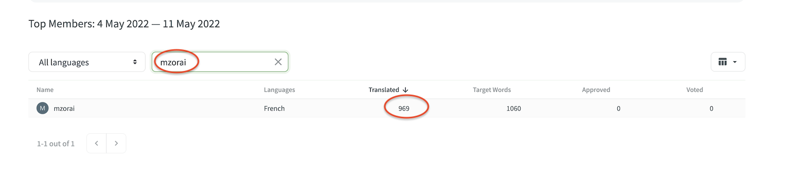

This repository contains the source and Translations for the [Work Metawerse Whitepaper](https://mirror.xyz/meedsdao.eth/EDh9QfsuuIDNS0yKcQDtGdXc25vfkpnnKpc3RYUTJgc).


## :trophy: Contribute ##

To contribute, join the [meeds-whitepaper](https://crowdin.com/project/meeds-whitepaper) project on Crowdin and start translating in your favorite language.

 :gift: **Rewards** : Contributions to the translations of this whitepaper are part of the *[Meeds Translation Program](https://builders.meeds.io/portal/g/:spaces:engage/engage/notes/20)* and are subject to community rewards. Join the [Meeds Builders](https://builders.meeds.io) community to participate in the [Translation Challenge](https://builders.meeds.io/portal/meeds/challenges/93) and earn [$MEEDs](https://www.coingecko.com/en/coins/meeds-dao) tokens for your work.


:bulb: *Hint* : You can get the number of words you have translated at : https://crowdin.com/project/meeds-whitepaper/reports/top-members




## :page_facing_up: Generate PDF ##

You can use the build script to generate a PDF version of the whitepaper in any of the supported languages.

*Prerequisites :* 
* [Pandoc](https://pandoc.org/)
* [BasicTeX](https://tug.org/mactex/morepackages.html)

*Usage :* ```./compile-pdf.sh [lang]```.
 
 ```- lang``` (default:en) : the 2-characters code of the language

 The resulting document is generated under build/meeds-whitepaper-$lang.pdf

## :sparkling_heart: Credits ##

Many thanks to [Ryan Frazier](https://pianomanfrazier.com/post/write-a-book-with-markdown/) and [Eisvogel pandoc-latex-template](https://github.com/Wandmalfarbe/pandoc-latex-template) for making their work reusable.

